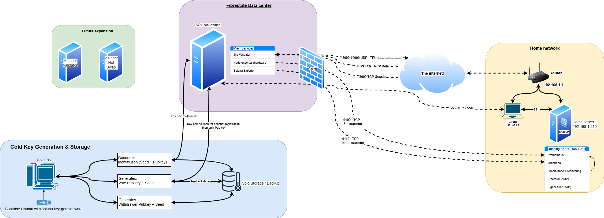

# Validator Projects Documentation

## Overview
This project serves as my first learning platform for blockchain infrastructure.

## Infrastructure Overview


## Table of Contents
- [Project Structure](#project-structure)
- [Validator Projects](#validator-projects)
  - [Solana Validator](#solana-validator)
  - [Ethereum Validator (Upcoming)](#ethereum-validator)
  - [Bitcoin Node](#bitcoin-node)
- [Infrastructure](#infrastructure)
- [Skills & Technologies used](#skills--technologies)
- [Monitoring & Metrics](#monitoring--metrics)
- [Resources & References](#resources--references)

## Project Structure
```
.
├── infrastructure/
│   ├── solana-validator/    # Solana validator documentation and configs
│   ├── ethereum/           # Ethereum & EigenLayer validator documentation
│   ├── bitcoin-node/      # Bitcoin node documentation
│   ├── home-server/       # Home server setup and services
│   └── home-router/       # Network and routing configuration
├── resources/            # Documentation, guides, and references
├── infra-overview.png    # Infrastructure overview diagram
└── todo.md              # List of things to improve
```

## Validator Projects

### Solana Validator
- **Status**: Active on Testnet
- **Validator Address**: [JDa72CkixfF1JD9aYZosWqXyFCZwMpnVjR15bVBW2QRF](https://www.validators.app/validators/JDa72CkixfF1JD9aYZosWqXyFCZwMpnVjR15bVBW2QRF?locale=en&network=testnet)
- **Documentation**: [Solana Validator Setup](infrastructure/solana-validator/README.md)
- **Metrics Dashboard**: [Validator Metrics](https://metric.seed42.co/goto/0_8z3r0HR?orgId=1) (Work in Progress)
- **Features**: JITO MEV Integration for enhanced block building and MEV rewards
- **Next Steps**: Optimize MEV performance and monitoring

### Ethereum Validator
- **Status**: Planning Phase
- **Documentation**: [Ethereum & EigenLayer Setup](infrastructure/ethereum/README.md)
- **Focus**: EigenLayer Integration for AVS Support

### Bitcoin Node
- **Status**: Active (Basic setup)
- **Documentation**: [Bitcoin Node Setup](infrastructure/bitcoin-node/README.md)
- **Metrics Dashboard**: [Node Metrics](https://metric.seed42.co/public-dashboards/4de1b04bbfd5466cbc7387071ae30786?from=now-15m&to=now&refresh=15s)

## Infrastructure

### Components
- **Validator Server**: Primary Solana validator (Fiberstate Data Center)
- **Home Server**: 
  - Metrics collection & visualization
  - Bitcoin node
  - Ethereum services (planned)
  - Prometheus & Grafana
- **Cold Storage**: Secure key generation and storage solution

## Skills & Technologies used

### General Skills
- **Linux**: System administration, optimization, and service management
- **SSH**: Key management, security hardening, and auditing
- **Networking**: Routing, firewall configuration, port management
- **Containerization**: Docker for service deployment

### Blockchain Technologies
- **Solana**: Validator operations, key management, monitoring, MEV optimization with JITO
- **Ethereum**: Coming soon - Validator operations with EigenLayer integration
- **Bitcoin**: Node operations and monitoring

## Monitoring & Metrics
- **Prometheus**: Metrics collection and storage
- **Grafana**: Visualization and public dashboards
- **Alerting**: Custom alert configurations for validator health

## Tools & Services
- **nginx**: Reverse proxy and SSL certificate management
- **Termius**: Local CLI for remote server access
- **Git/Github**: Documentation and configuration management
- **AI Assistance**: Cursor, ChatGPT, Claude Sonnet - for development and documentation support

## Resources & References
For a comprehensive list of resources, tools, and references used in this project, please see [Resources Documentation](resources/README.md).

contact me: contact@seed42.co

